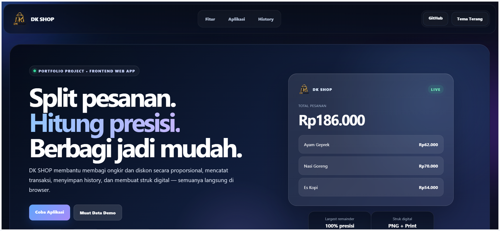
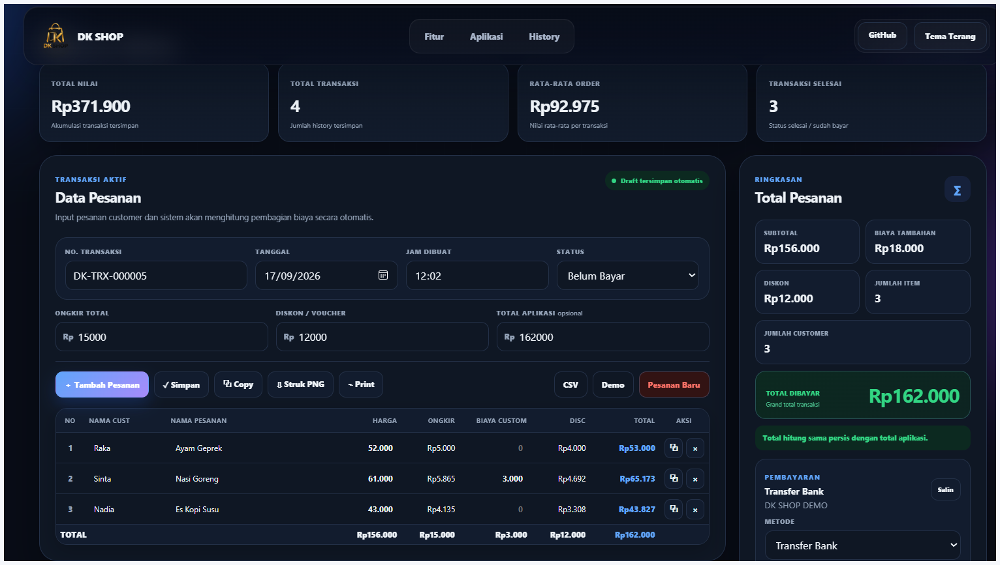
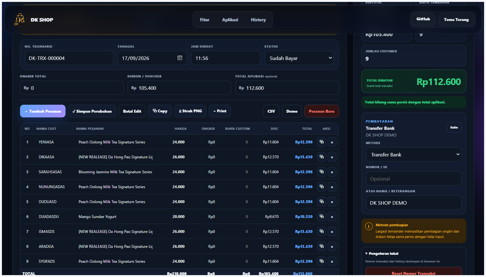
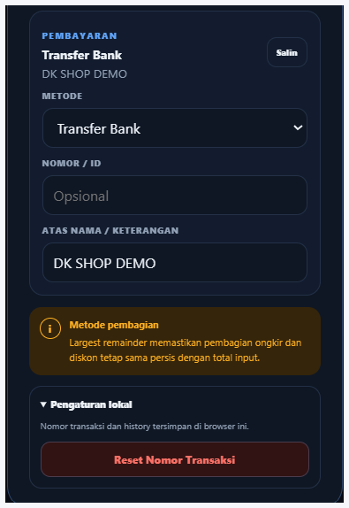
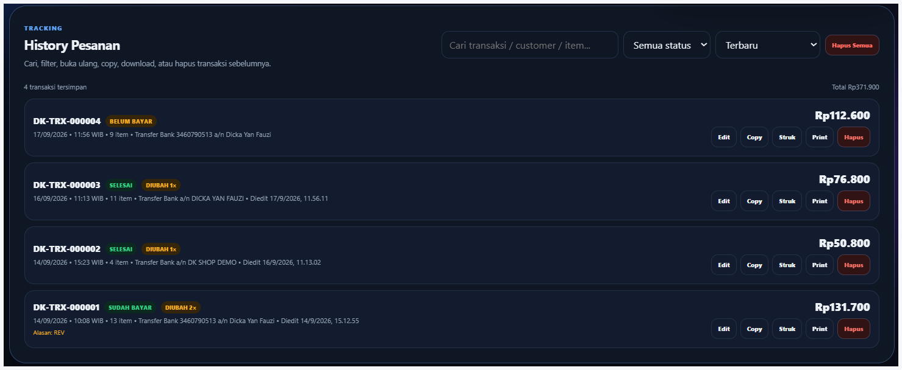
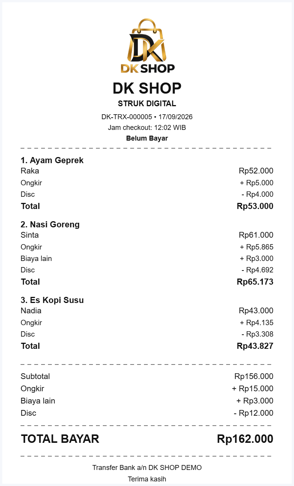

# DK SHOP — Smart Order Split


DK SHOP adalah aplikasi frontend local-first untuk mencatat pesanan bersama dan membagi ongkir serta diskon secara proporsional sampai rupiah terakhir. Proyek ini dibuat sebagai portfolio yang menunjukkan pengelolaan state, validasi transaksi, persistensi browser, export data, dan pembuatan struk digital tanpa framework.

**Versi:** v1.5.1

**Live demo:** https://dikafauzi.github.io/dk-shop-portfolio/

## Masalah yang Diselesaikan

Pembelian bersama sering membutuhkan pembagian ongkir dan voucher yang adil. Pembulatan biasa dapat membuat jumlah pembagian berbeda dari total aplikasi. DK SHOP menggunakan metode largest remainder agar hasil pembagian selalu sama persis dengan nominal sumber.

## Fitur Utama

- Pembagian ongkir dan diskon proporsional dengan largest remainder
- Biaya tambahan khusus per item
- Validasi data dan perlindungan diskon berlebih
- Nomor transaksi persisten dan terlindungi dari collision
- Nomor transaksi hanya dikunci saat transaksi baru disimpan; proses edit tidak memakai nomor baru
- Autosave draft menggunakan LocalStorage
- History dengan pencarian, filter, sorting, dan analytics
- Edit transaksi dengan alasan opsional, waktu edit, dan jumlah revisi
- Status Draft, Belum Bayar, Sudah Bayar, Selesai, dan Dibatalkan
- Metode pembayaran fleksibel
- Download struk PNG dan print thermal 80 mm
- Export CSV UTF-8 dengan sanitasi formula spreadsheet
- Copy rincian transaksi
- Dark mode dan layout responsif
- Logo resmi DK SHOP pada website dan struk

## Screenshots

### Landing Page
Hero utama DK SHOP dengan navigasi, preview transaksi, dan CTA menuju aplikasi.



### Dashboard Overview
Tampilan utama Smart Order Split yang menampilkan analytics, data pesanan, validasi, dan ringkasan pembayaran.



### Order Table
Tabel transaksi untuk mengelola customer, item, harga, ongkir, biaya custom, diskon, dan total akhir.



### Payment & Local Settings
Panel pembayaran dan pengaturan lokal untuk metode pembayaran serta kontrol sequence transaksi.



### Transaction History
History transaksi dengan pencarian, filter status, sorting, edit, copy, print, dan delete.



### Digital Receipt
Struk digital DK SHOP yang dapat di-download sebagai PNG atau dicetak sebagai thermal receipt.



## Cara Menjalankan

Tidak ada dependency produksi atau proses build.

1. Clone atau download repository.
2. Buka folder di Visual Studio Code.
3. Buka `index.html` menggunakan Live Server.
4. Akses alamat lokal yang tampil, biasanya `http://127.0.0.1:5500`.

Halaman juga dapat dibuka langsung, tetapi Live Server direkomendasikan agar pemuatan aset dan download Canvas konsisten di seluruh browser.

## Cara Menggunakan

1. Isi customer, nama pesanan, dan harga.
2. Isi ongkir, diskon, biaya custom, dan total aplikasi bila diperlukan.
3. Pastikan panel validasi tidak menampilkan error.
4. Simpan transaksi ke history.
5. Gunakan tombol Edit pada history untuk memperbarui transaksi tersimpan.
6. Download struk PNG, print, copy, atau export CSV.

## Arsitektur

| Bagian | Tanggung jawab |
|---|---|
| `index.html` | Struktur UI, metadata, dan template print |
| `assets/js/core.js` | Fungsi murni perhitungan, sequence, nominal, dan CSV |
| `assets/js/app.js` | State UI, validasi, LocalStorage, history, dan struk |
| `assets/js/motion.js` | Animasi, reveal, ripple, dan reduced motion |
| `assets/css/styles.css` | Layout, tema, responsif, dan print |
| `assets/css/motion.css` | Efek visual dan preferensi reduced motion |
| `tests/core.test.js` | Unit test untuk logika bisnis inti |

## Pengujian

Jalankan unit test dengan Node.js 22 atau yang lebih baru:

```bash
node --test
```

Periksa syntax JavaScript:

```bash
node --check assets/js/core.js
node --check assets/js/app.js
node --check assets/js/motion.js
```

GitHub Actions menjalankan seluruh pemeriksaan tersebut otomatis pada push ke `main` dan setiap pull request.

## Tech Stack

- HTML5
- CSS3
- Vanilla JavaScript
- LocalStorage
- Canvas API
- Node.js built-in test runner
- GitHub Actions

## Batasan

Versi ini tidak memakai backend. Draft, history, tema, dan nomor transaksi hanya tersimpan pada browser/perangkat yang sedang digunakan. Data tidak tersinkron antarperangkat dan dapat hilang jika penyimpanan browser dibersihkan. Versi produksi memerlukan autentikasi, API, database, backup, dan penomoran transaksi atomik di server.

## Privasi

Tidak ada data transaksi yang dikirim ke server oleh aplikasi ini. Seluruh pemrosesan berlangsung di browser pengguna.
